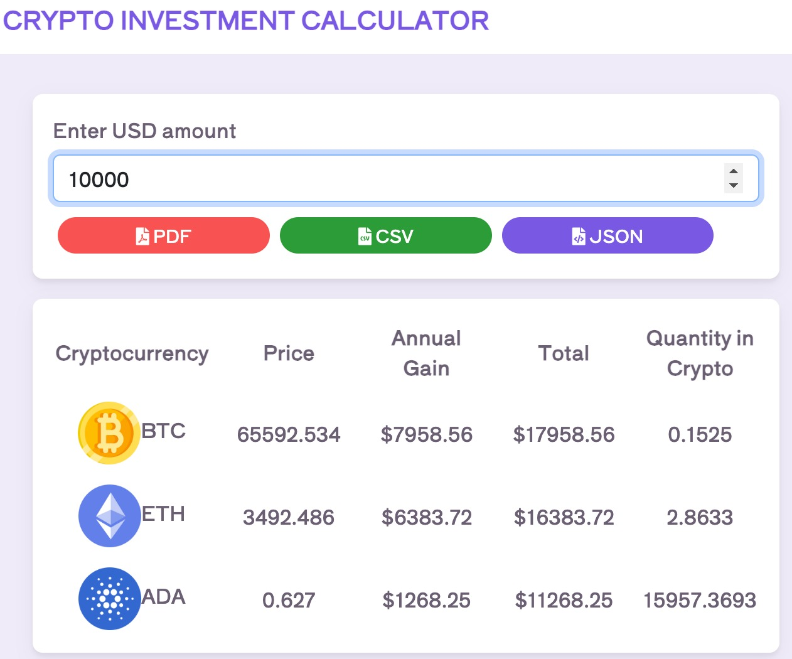

# Crypto Investment Calculator

## Overview
The Crypto Investment Calculator is a user-friendly interface that enables users to input a USD amount and instantly view the corresponding gains, cryptocurrency equivalences, and download investment data in various formats. It's designed to dynamically fetch and display data using a backend API developed with Ruby on Rails 6.

## Features
- **USD Input**: Users can type in an amount in USD to see potential investment returns.
- **Dynamic Data Table**: Showcases gains, cryptocurrency values, and equivalents based on current exchange rates.
- **Downloadable Reports**: Allows for the export of data in PDF, CSV, and JSON formats.
- **Real-Time Updates**: Integrates with a backend API for live data retrieval and display.

## Technologies
- **Frontend**: Developed with Vite and React for an optimized developer experience and high performance in production.
- **Testing**: Function testing implemented to ensure code reliability and performance.
- **Styling**: A clean and responsive layout to provide an excellent user experience on both desktop and mobile devices.

## Local Setup
1. Clone the repository.
2. Create a `.env` file in the project root.
3. Inside the `.env`, add the line: `VITE_API_URL='http://localhost:3000'`.
4. Run `npm install` to install dependencies.
5. Start the app in development mode with `npm run dev`.

## Backend Integration
The frontend interacts seamlessly with a backend service, which is necessary for full functionality. To set up the backend, refer to [this repository](https://github.com/jhonjat75/investocripto) and follow the instructions provided.

*Note: Ensure to replace the image link with the actual path to your screenshot for the application.*

## Contribution
Contributions to the project are welcome. After forking and cloning the repository, you can submit pull requests for any enhancements or fixes you implement.

## License
This project is open-sourced under the MIT License. See the LICENSE file for more details.
